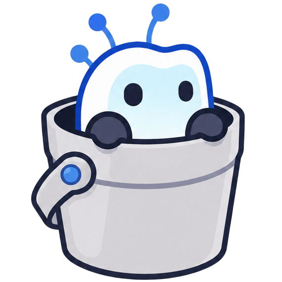

<p align="center"><br/></p>
<p align="center">Pannello di controllo AI per agenti definiti da repository, deployment Docker, orchestrazione sidecar e operazioni API-first.</p>
<p align="center"><a href="README.md">English</a> | <a href="README.zh.md">中文</a> | <a href="README.fr.md">Français</a> | <a href="README.ja.md">日本語</a> | <a href="README.de.md">Deutsch</a> | <a href="README.ko.md">한국어</a> | <a href="README.es.md">Español</a> | <a href="README.ar.md">العربية</a> | <a href="README.pt.md">Português</a> | <a href="README.it.md">Italiano</a></p>
## Avvio Rapido
```bash
cd backend && go run ./cmd/server
pnpm dev --host 0.0.0.0 --port 5173
```
## Docker
```bash
docker pull ghcr.io/mudern/agentbucket:latest
docker run -p 8080:8080 -v /var/run/docker.sock:/var/run/docker.sock ghcr.io/mudern/agentbucket:latest
```
Vedi [README.md](README.md) per la documentazione completa.
