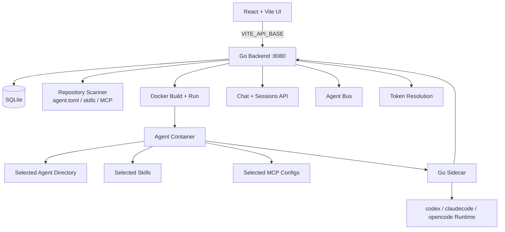

<p align="center">
  
  <br/>
  
</p>

<p align="center">
  AI agent control plane for repository-defined agents, Docker deployments, sidecar orchestration, and API-first operations.
</p>

<p align="center">
  <a href="https://go.dev/"></a>
  <a href="https://react.dev/"></a>
  <a href="https://vite.dev/"></a>
  <a href="https://tailwindcss.com/"></a>
  <a href="https://www.sqlite.org/"></a>
  <a href="https://www.docker.com/"></a>
</p>

<p align="center">
  <a href="README.md">English</a> |
  <a href="README.zh.md">中文</a> |
  <a href="README.fr.md">Français</a> |
  <a href="README.ja.md">日本語</a> |
  <a href="README.de.md">Deutsch</a> |
  <a href="README.ko.md">한국어</a> |
  <a href="README.es.md">Español</a> |
  <a href="README.ar.md">العربية</a> |
  <a href="README.pt.md">Português</a> |
  <a href="README.it.md">Italiano</a>
</p>

AgentBucket scans agent definitions from Git/GitHub/local repositories, packages selected agents with standard skills and MCP configs into Docker images, runs a sidecar in each container, and exposes both a web UI and curl-friendly APIs for deployment, chat, token resolution, and agent-to-agent messaging.

## What It Does

- Defines agents with `agents/<agent-id>/agent.toml`.
- Validates and packages standard skills from `skills/<skill-id>/SKILL.md`.
- Packages MCP config files from `mcp/*.json`.
- Builds Docker images per deployment and injects the Go sidecar.
- Supports `claudecode`, `codex`, and `opencode` runtimes.
- Imports AI provider tokens from CCS env files.
- Stores users, sessions, messages, deployments, repositories, and state in SQLite.
- Provides real chat sessions with SSE streaming through sidecar or Anthropic-compatible APIs.
- Provides a bus for agent discovery and message passing.
- Provides token resolution through sidecars with agent-level authorization.

## Architecture



## Quick Start

### Requirements

- Go 1.22+
- Node.js 20+
- pnpm 11+
- Docker, if you want to deploy agents into containers
- Optional CCS provider env files under `~/.config/ccs/providers/*.env`

The local environment may have proxy variables that break localhost requests. Use `NO_PROXY=127.0.0.1,localhost` for servers and `curl --noproxy '*'` for checks.

### Start The Backend

From the repo root:

```bash
cd backend
NO_PROXY=127.0.0.1,localhost \
GOCACHE=/tmp/agentbucket-go-cache \
GOMODCACHE=/tmp/agentbucket-go-mod \
AGENTBUCKET_ADDR=0.0.0.0:8080 \
AGENTBUCKET_BUILD_TIMEOUT=300s \
go run ./cmd/server
```

The backend listens on `http://127.0.0.1:8080`.

Use `0.0.0.0:8080` when Docker sidecars need to call back to the host through `host.docker.internal`.

### Start The Frontend

In another terminal, from the repo root:

```bash
NO_PROXY=127.0.0.1,localhost \
VITE_API_BASE=http://127.0.0.1:8080 \
pnpm dev --host 0.0.0.0 --port 5173
```

Vite may choose another port if `5173` is already occupied. Use the URL printed by Vite, for example `http://localhost:5178/`.

### Smoke Check

```bash
curl --noproxy '*' -sS http://127.0.0.1:8080/health
curl --noproxy '*' -sS http://127.0.0.1:8080/api/current-user
curl --noproxy '*' -sS http://127.0.0.1:8080/api/deploy-options
```

## Docker Compose

```bash
docker-compose up -d
```

The compose setup mounts:

- `/var/run/docker.sock` so the backend can manage host Docker containers.
- `${HOME}/.config/ccs/providers` into `/providers` for AI token import.
- A named volume for SQLite and runtime state.

This is Docker-out-of-Docker, not Docker-in-Docker.

## Environment Variables

| Variable | Default | Purpose |
| --- | --- | --- |
| `AGENTBUCKET_ADDR` | `127.0.0.1:8080` | Backend listen address |
| `AGENTBUCKET_DATA_DIR` | `backend/.data` | SQLite DB and generated state |
| `AGENTBUCKET_BUILD_TIMEOUT` | `300s` | Docker build timeout |
| `AGENTBUCKET_SIDECAR_HOST` | `127.0.0.1` | Host used in sidecar URLs |
| `AGENTBUCKET_PROVIDERS_DIR` | `~/.config/ccs/providers` | CCS provider env directory |
| `VITE_API_BASE` | `http://127.0.0.1:8080` | Frontend API base |

## Repository Standard

An agent repository can contain many agents, skills, and MCP configs:

```text
agents/
  legal-summarizer/
    agent.toml
  release-writer/
    agent.toml
skills/
  knowledge-base/
    SKILL.md
  git-reader/
    SKILL.md
mcp/
  github-mcp.json
  filesystem-mcp.json
```

### Agent Manifest

```toml
id = "legal-summarizer"
name = "Legal Summarizer"
description = "Summarize legal documents and extract risk clauses."
model = "deepseek-v4-pro[1m]"
runtime = "claudecode"
runtime_version = "latest"
api_token = "deepseek"
skills = ["knowledge-base", "document-parser"]
mcps = ["notion-mcp", "filesystem-mcp"]
extra_install = ["apk add --no-cache github-cli"]
```

Required fields:

| Field | Meaning |
| --- | --- |
| `id` | Stable agent ID used by API, deployment, bus, and container naming |
| `name` | UI display name |
| `runtime` | `claudecode`, `codex`, or `opencode` |
| `model` | Model passed to the runtime/API layer |
| `api_token` | Name of an AI token known to AgentBucket |
| `skills` | Skill directory IDs under `skills/` |
| `mcps` | MCP config IDs under `mcp/` |

Skills must be standard skill directories. Every selected skill must include `SKILL.md`; deployment packaging fails fast if it is missing.

More detail: [backend/AGENT_STANDARD.md](backend/AGENT_STANDARD.md).

## Deployment Flow

1. Bind repositories in the UI or `POST /api/repositories`.
2. Backend scans configured repos and reads `agent.toml`.
3. User selects repository, commit, agent, runtime, model, API token, skills, MCPs, and auth tokens.
4. Backend creates a build context containing:
   - selected agent directory
   - selected skill directories
   - selected MCP configs
   - `agentbucket.config.json`
   - real sidecar source from `backend/cmd/sidecar/main.go`
   - generated Dockerfile
5. Backend builds a Docker image and starts a container.
6. Sidecar exposes health, status, chat, token, start/stop, and bus helper endpoints.

## Runtime And Chat

The backend chat endpoint is:

```text
POST /api/agents/{agentId}/messages
```

Payload:

```json
{
  "sessionId": "session-id",
  "content": "hello",
  "stream": true
}
```

Routing order:

1. Running sidecar for that agent, if available.
2. Runtime/API fallback through the agent's configured AI token.

Streaming responses use SSE. The frontend consumes those deltas and persists final user/assistant messages through the backend.

## API Overview

The API is intentionally curl-friendly. Set:

```bash
export AGENTBUCKET_API=http://127.0.0.1:8080
```

Common endpoints:

```text
GET    /health
GET    /api/current-user

GET    /api/repositories
POST   /api/repositories
PATCH  /api/repositories/{id}
DELETE /api/repositories/{id}
POST   /api/repositories/{id}/sync

GET    /api/agents
POST   /api/agent-definitions/scan

GET    /api/deploy-options
GET    /api/deployments
POST   /api/deployments
GET    /api/deployments/{id}
GET    /api/deployments/{id}/status
POST   /api/deployments/{id}/start
POST   /api/deployments/{id}/stop
DELETE /api/deployments/{id}

GET    /api/agents/{agentId}/sessions
POST   /api/agents/{agentId}/sessions
DELETE /api/agents/{agentId}/sessions/{sessionId}
GET    /api/agents/{agentId}/messages?sessionId=...
POST   /api/agents/{agentId}/messages

GET    /api/ai-tokens
POST   /api/ai-tokens
PATCH  /api/ai-tokens/{id}
DELETE /api/ai-tokens/{id}

GET    /api/auth-tokens
POST   /api/auth-tokens
PATCH  /api/auth-tokens/{id}
DELETE /api/auth-tokens/{id}
POST   /api/tokens/resolve

GET    /api/bus/agents
POST   /api/bus/agents/{agentId}/register
POST   /api/bus/agents/{agentId}/message
GET    /api/bus/messages?toAgent=...
```

Full curl examples live in [agentbucket-api skill](backend/examples/agent-repo/skills/agentbucket-api/SKILL.md).

## Sidecar API

Each deployed container runs a sidecar with endpoints such as:

```text
GET  /health
GET  /status
POST /agent/start
POST /agent/stop
POST /agent/chat
POST /tokens/get
POST /bus/register
```

Use the `sidecarUrl` returned by `POST /api/deployments` or `GET /api/deployments/{id}`.

## Project Structure

```text
backend/
  cmd/server/          Go backend: HTTP API, SQLite, Docker orchestration
  cmd/sidecar/         Sidecar source copied into each deployment image
  examples/agent-repo/ Example agents, skills, and MCP configs
  tokens/              Example token scripts
src/
  api/                 Frontend API client
  components/          Shared React components
  pages/               Product pages
backend/examples/agent-repo/skills/agentbucket-api/ Default API skill for all agents
temp.md                Current handoff notes and recent progress
docker-compose.yml     Single-service deployment with host Docker socket
```

## Development Checks

Backend:

```bash
cd backend
GOCACHE=/tmp/agentbucket-go-cache \
GOMODCACHE=/tmp/agentbucket-go-mod \
go test ./...
```

Frontend:

```bash
pnpm build
```

The frontend build currently passes with Vite's large chunk warning.

## Current Limitations

- `handlers.go` is still large and can be split by resource later.
- Runtime CLI integration is real but still basic: sidecar chat shells out to `codex`, `claude`, or `opencode` per request instead of maintaining a long-lived interactive runtime session.
- Docker builds can be slow when runtime CLIs are installed from npm.
- The frontend is still evolving; some management flows are intentionally optimized for demo/local control-plane usage before hardening permissions and audit trails.

## License

MIT
