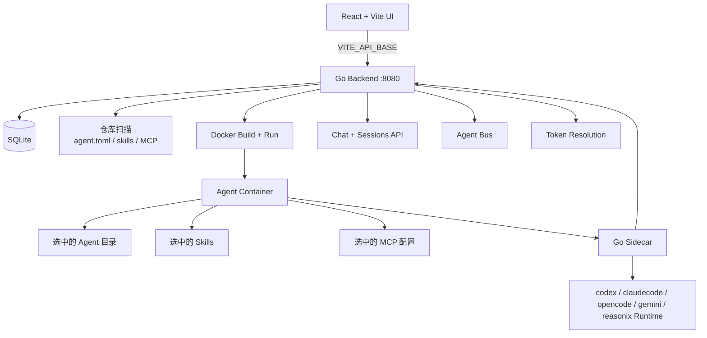

<p align="center">
  
  <br/>
  
</p>

<p align="center">
  面向仓库定义 Agent、Docker 部署、Sidecar 编排和 API-first 运维的 AI Agent 控制平面。
</p>

<p align="center">
  <a href="https://go.dev/"></a>
  <a href="https://react.dev/"></a>
  <a href="https://vite.dev/"></a>
  <a href="https://tailwindcss.com/"></a>
  <a href="https://www.sqlite.org/"></a>
  <a href="https://www.docker.com/"></a>
</p>

AgentBucket 会从 Git/GitHub/本地仓库扫描 `agent.toml`，把选中的 Agent、标准 Skill 和 MCP 配置打包成 Docker 镜像，在容器里运行 sidecar，并通过 Web UI 和 curl-friendly API 提供部署、对话、Token 解析和 Agent 总线能力。

## 能力概览

- 使用 `agents/<agent-id>/agent.toml` 定义 Agent。
- 校验并打包 `skills/<skill-id>/SKILL.md` 标准 Skill。
- 打包 `mcp/*.json` MCP 配置。
- 部署时自动生成 Docker build context 并注入 Go sidecar。
- 支持 `claudecode`、`codex`、`opencode`、`gemini` 和 `reasonix` runtime。
- 从 CCS provider env 文件导入 AI Token。
- 使用 SQLite 保存用户、仓库、部署、会话、消息和状态。
- 支持 SSE 流式聊天、sidecar chat 转发和 Anthropic-compatible API fallback。
- 支持 Agent Bus 发现和消息通信。
- 支持通过 sidecar 做 Agent 级别鉴权的 Token 解析。

## 架构



## 快速开始

### 前置条件

- Go 1.22+
- Node.js 20+
- pnpm 11+
- Docker，用于部署 Agent 容器
- 可选：`~/.config/ccs/providers/*.env` 下的 CCS provider env 文件

如果本机代理变量影响 localhost，请给服务加 `NO_PROXY=127.0.0.1,localhost`，curl 检查时使用 `curl --noproxy '*'`。

### 启动后端

从仓库根目录运行：

```bash
cd backend
NO_PROXY=127.0.0.1,localhost \
GOCACHE=/tmp/agentbucket-go-cache \
GOMODCACHE=/tmp/agentbucket-go-mod \
AGENTBUCKET_ADDR=0.0.0.0:8080 \
AGENTBUCKET_BUILD_TIMEOUT=300s \
go run ./cmd/server
```

后端地址：`http://127.0.0.1:8080`。

使用 `0.0.0.0:8080` 是为了让 Docker sidecar 可以通过 `host.docker.internal` 回连宿主机后端。

### 启动前端

另开一个终端，从仓库根目录运行：

```bash
NO_PROXY=127.0.0.1,localhost \
VITE_API_BASE=http://127.0.0.1:8080 \
pnpm dev --host 0.0.0.0 --port 5173
```

如果 `5173` 被占用，Vite 会自动选择其他端口。请使用 Vite 输出的地址，例如 `http://localhost:5178/`。

### 快速检查

```bash
curl --noproxy '*' -sS http://127.0.0.1:8080/health
curl --noproxy '*' -sS http://127.0.0.1:8080/api/current-user
curl --noproxy '*' -sS http://127.0.0.1:8080/api/deploy-options
```

## Docker Compose

```bash
docker-compose up -d
```

Compose 会挂载：

- `/var/run/docker.sock`，用于管理宿主机 Docker 容器。
- `${HOME}/.config/ccs/providers` 到 `/providers`，用于导入 AI Token。
- 命名 volume 保存 SQLite 和运行状态。

这是 Docker-out-of-Docker，不是 Docker-in-Docker。

## Agent 仓库标准

一个仓库可以包含多个 Agent、Skill 和 MCP 配置：

```text
agents/
  legal-summarizer/
    agent.toml
skills/
  knowledge-base/
    SKILL.md
mcp/
  github-mcp.json
```

示例：

```toml
id = "legal-summarizer"
name = "Legal Summarizer"
description = "Summarize legal documents and extract risk clauses."
model = "deepseek-v4-pro[1m]"
runtime = "claudecode"
runtime_version = "latest"
api_token = "deepseek"
skills = ["knowledge-base", "document-parser"]
mcps = ["notion-mcp", "filesystem-mcp"]
extra_install = ["apk add --no-cache github-cli"]
```

`runtime` 当前支持：`claudecode`、`codex`、`opencode`、`gemini`、`reasonix`。

更完整的标准见 [backend/AGENT_STANDARD.md](backend/AGENT_STANDARD.md)。

## 部署流程

1. 在 UI 或 `POST /api/repositories` 绑定仓库。
2. 后端扫描仓库并读取 `agent.toml`。
3. 选择仓库、commit、Agent、runtime、模型、API Token、Skill、MCP 和鉴权 Token。
4. 后端生成 build context：
   - 选中的 Agent 目录
   - 选中的 Skill 目录
   - 选中的 MCP 配置
   - `agentbucket.config.json`
   - `backend/cmd/sidecar/main.go`
   - 生成的 Dockerfile
5. 构建 Docker 镜像并启动容器。
6. sidecar 提供 health、status、chat、token、start/stop 和 bus 辅助接口。

## API 概览

完整 curl 示例见 [agentbucket-api skill](backend/examples/agent-repo/skills/agentbucket-api/SKILL.md)。

常用接口：

```text
GET    /health
GET    /api/current-user
GET    /api/repositories
POST   /api/repositories
GET    /api/agents
POST   /api/agent-definitions/scan
GET    /api/deploy-options
POST   /api/deployments
GET    /api/deployments/{id}/status
POST   /api/deployments/{id}/start
POST   /api/deployments/{id}/stop
GET    /api/agents/{agentId}/sessions
POST   /api/agents/{agentId}/messages
GET    /api/bus/agents
GET    /api/bus/messages?toAgent=...
POST   /api/tokens/resolve
```

## 开发检查

后端：

```bash
cd backend
GOCACHE=/tmp/agentbucket-go-cache \
GOMODCACHE=/tmp/agentbucket-go-mod \
go test ./...
```

前端：

```bash
pnpm build
```

当前前端构建会通过，但 Vite 仍会提示 chunk size warning。

## 当前限制

- `handlers.go` 仍然偏大，后续可以按资源继续拆分。
- runtime CLI 已经真实接入，但 sidecar chat 仍是按请求 shell out 到所选 runtime CLI，还不是长生命周期交互式 runtime session。
- Docker build 依赖 npm 安装 runtime CLI，网络慢时构建会慢。
- 权限、审计和多租户隔离仍处于本地控制平面阶段，后续需要继续加固。

## 许可

MIT
